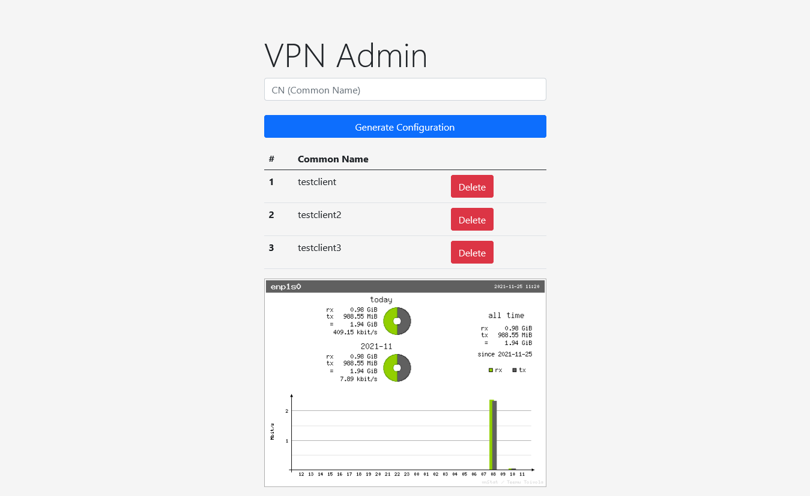

# OpenVPN-WebAdmin Version 0.2 -- Work in Progress
Manage OpenVPN configurations in a web browser

Only tested on Ubuntu Server 20.04 w/ LEMP stack.

This is functional code serving as a rough draft for the project. 

It is barebones and does not incorporate adequate security features for production use. 

# Installation

1. Fill out the blank information in the `config.php`
2. Run `php installation.php` 
3. Install OpenVPN on a separate server using the [OpenVPN Installer for Webadmin](https://github.com/bhopkins0/OpenVPN-Installer-For-Webadmin). **This is required to ensure compatibility.**

# Todo: 
* Display status.log
* Create installation file for MySQL table creation and webadmin password
* Support multiple accounts
* Clean up code: indent, make comments, tidy up if statements, etc
* Make page refresh after adding client
* Sanitize input
* Security enchancements
